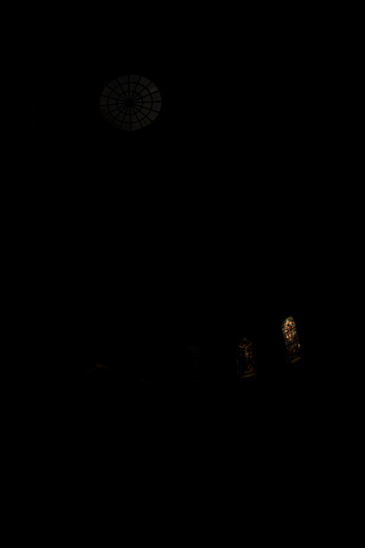
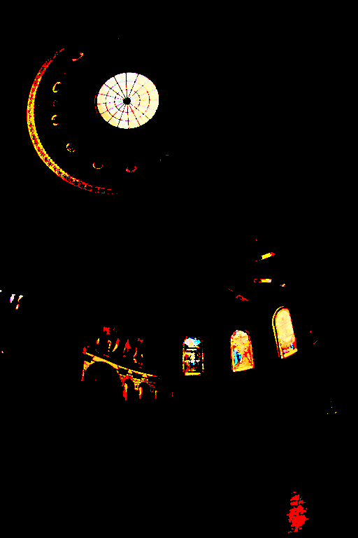

## Grayscaling an image.

Input                                        |  Output
:-------------------------------------------:|:--------------------------------------------:
  |  

## Blurring an image.

Input                                        |  Output
:-------------------------------------------:|:---------------------------------------------:
  |  

## Perfoming tone mapping on an image. 

Input                                        |  Output
:-------------------------------------------:|:--------------------------------------------:
    | 